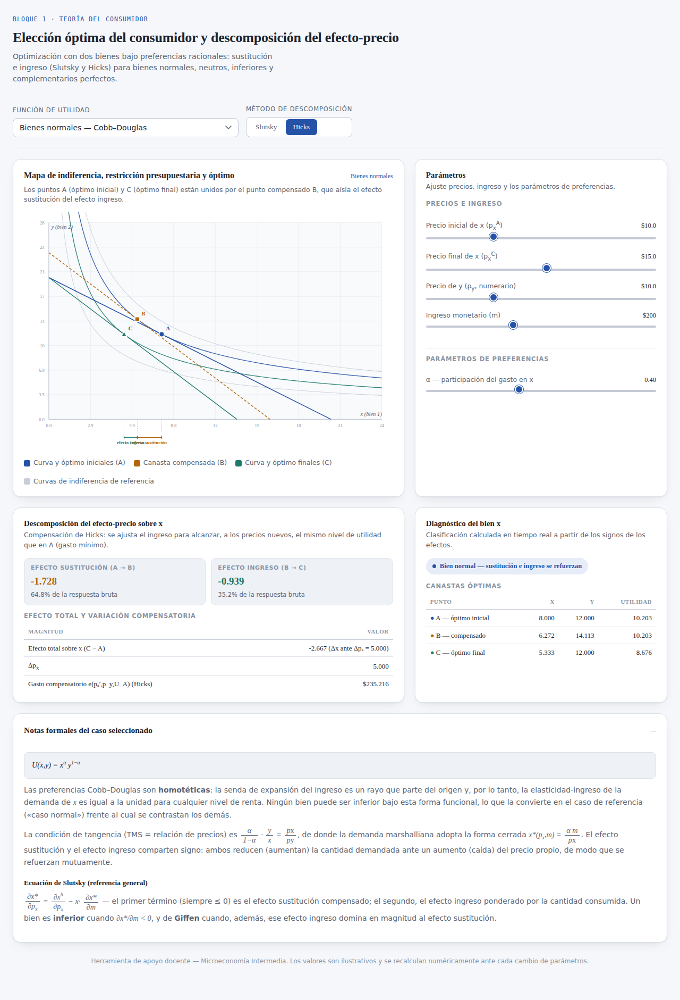

# Elección óptima del consumidor — simulador interactivo

Simulador interactivo, en un único archivo HTML autocontenido, para la enseñanza de la teoría del consumidor en cursos de Microeconomía Intermedia. Permite visualizar el óptimo del consumidor bajo distintas funciones de utilidad y descomponer el efecto de una variación de precio en efecto sustitución y efecto ingreso, mediante los procedimientos de **Slutsky** y de **Hicks**.

**Demo en vivo:** `https://<usuario>.github.io/<repositorio>/consumer_choice_standalone.html`
*(reemplazar por la dirección efectiva una vez publicado el repositorio mediante GitHub Pages — véase la sección [Publicación](#publicación))*



## Descripción

La herramienta calcula, para cada combinación de precios, ingreso y parámetros de preferencias que el usuario define mediante controles deslizantes, la canasta óptima del consumidor y su descomposición ante una variación del precio del bien x. El cálculo se resuelve de forma enteramente numérica (búsqueda áurea unidimensional, tanto para el problema primal de maximización de utilidad como para el problema dual de minimización del gasto), por lo que el resultado es robusto ante soluciones de esquina y válido para cualquier combinación de parámetros admitida por cada caso.

## Casos contemplados

| Función de utilidad | Caso ilustrado | Efecto sustitución | Efecto ingreso |
|---|---|---|---|
| Cobb–Douglas, U(x,y) = xᵅy¹⁻ᵅ | Bien normal (referencia homotética) | Refuerza | Refuerza |
| Cuasi-lineal, U(x,y) = A·ln(x) + y | Bien neutro | Explica la totalidad de la respuesta | Nulo |
| No separable, U(x,y) = A·ln(x) + y·(1 − c·x) | Bien inferior | Domina (ley de demanda se preserva) | Se opone |
| Complementarios perfectos (Leontief), U(x,y) = min(x/a, y/b) | Efecto sustitución nulo | Nulo | Explica la totalidad de la respuesta |

Un panel de diagnóstico clasifica automáticamente el bien (normal, neutro, inferior o de Giffen) a partir de los signos calculados en cada actualización de los controles, lo que permite además que el estudiantado explore, mediante los parámetros del caso inferior, la dificultad inherente a la construcción de un bien de Giffen a partir de preferencias bien comportadas.

## Uso en el aula

1. Seleccionar la función de utilidad en el menú desplegable superior.
2. Ajustar precio inicial y final del bien x, precio del bien y e ingreso monetario mediante los controles deslizantes.
3. Alternar entre el método de descomposición de Slutsky y el de Hicks para contrastar ambas definiciones de compensación.
4. Consultar el panel lateral para los valores numéricos de las canastas óptimas (A, B y C) y la magnitud de cada efecto, y el panel de notas formales para la justificación analítica del caso seleccionado.

## Estructura del repositorio

```
.
├── consumer_choice_standalone.html   # Aplicación completa (HTML + CSS + JavaScript, sin dependencias externas de compilación)
├── captura.png                       # Imagen de vista previa utilizada en este README
└── README.md
```

El archivo `consumer_choice_standalone.html` no requiere proceso de compilación ni instalación de paquetes: es HTML, CSS y JavaScript plano, con la única dependencia externa de las tipografías Spectral, IBM Plex Sans e IBM Plex Mono, servidas desde Google Fonts.

## Publicación

El repositorio está preparado para servirse mediante **GitHub Pages**. El procedimiento completo de publicación y de integración en Moodle se documenta por separado en `instrucciones-publicacion-github-moodle.md` (disponible en el proyecto de la cátedra). En síntesis: `Settings → Pages → Deploy from a branch → main → / (root)`.

## Requisitos técnicos

Cualquier navegador moderno con JavaScript habilitado (Chrome, Firefox, Edge, Safari). No se requiere conexión a internet salvo para la carga inicial de las tipografías; el resto de la aplicación se ejecuta íntegramente en el cliente, sin comunicación con servidor alguno.

## Autoría y uso

Material de apoyo docente desarrollado para la cátedra de Microeconomía Intermedia. Los valores numéricos son ilustrativos y se recalculan dinámicamente; no representan datos empíricos reales salvo indicación expresa. Se autoriza su reutilización y adaptación con fines educativos, citando la fuente.
